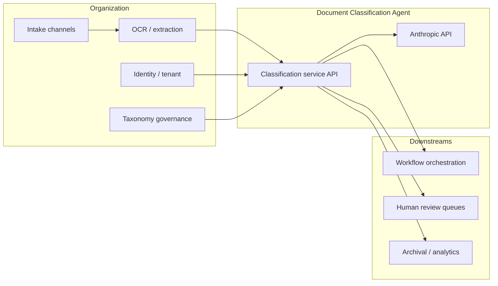

# Gate 2: Architecture and Design

**Project:** Document Classification Agent (Worked Example)
**Date:** 2026-04-05
**Author:** ai-orchestrator-framework contributors
**Status:** Draft

**Gate 0 reference:** `examples/document-classification-agent/gate-0.md`
**Gate 1 reference:** `examples/document-classification-agent/gate-1.md`

Reference: `manual.md` Phase 3.

---

## Components and Contracts

### Logical Boundaries

The system sits between **intake** (authoritative text + tenant/taxonomy context) and **downstream workflow routers**. Runtime classification is performed by a single primary LLM call per document (per Prompt Contract), with validation, logging, and fallback around that call.

**Context diagram (textual C4 Context):**



**Container diagram (textual C4 Container):**

| Container | Responsibility |
|---|---|
| **Classification service API** | Validates inputs, enforces idempotency, assembles prompts, calls LLM client, validates outputs, emits routing decisions or fallbacks, structured logs/traces. |
| **LLM client + resilience layer** | Timeouts, retries (bounded), rate-limit handling, circuit behavior per Failure Mode Registry. |
| **Taxonomy + config store** | Versioned taxonomy artifact (labels, descriptions, hierarchy, optional per-label policies such as always-review). |
| **Queue / DLQ** | Backpressure for retries and human handoff; idempotent consumers downstream. |
| **Observability** | Metrics (latency, errors, fallback rate, token usage), audit logs per Data Boundary. |

If formal C4 diagram image files are added later, link them here; for this worked example, the diagrams above satisfy the Gate 2 “logical boundaries” requirement.

---

### Bill of Materials

| Item | Type | Owner | Notes |
|---|---|---|---|
| Classification service runtime (containers or functions) | Service | Platform team | Horizontally scalable; matches volume from Gate 1. |
| Anthropic API (`claude-sonnet-4-6`) | External API | Anthropic | Runtime LLM; pinned per ADR-001. |
| Secrets store (API keys) | Infrastructure | Platform / security | No keys in repo; rotation per policy. |
| Taxonomy artifact storage | Config | Product / governance | Versioned blob or git-backed config; classifier pins version per request/batch. |
| Message queue + DLQ | Infrastructure | Platform team | Retry and human handoff; idempotency keys. |
| Identity / tenant context provider | Service | Identity team | Tenant isolation for routes and logs. |
| Observability (logs, metrics, traces) | Infrastructure | Platform team | Must support audit without violating Data Boundary. |
| Downstream workflow connectors | Integration | Product teams | Idempotent writes; blast radius per Gate 1. |
| CI/CD pipeline + IaC | Config | Engineering | Deploy pinned model id + taxonomy version. |

---

### Class Interface Contract

The schema defining what a valid input looks like and what a valid output looks like. No implementation begins until this contract exists.

**Link to contract file:** `examples/document-classification-agent/contracts/class-interface-contract.md`

**Summary of input schema:**

```
A single classification request identifies the document and tenant, pins taxonomy and model versions, and supplies authoritative text (or a defined chunk in oversize flows). Optional correlation/idempotency and trace fields are included for integration. Inputs outside the Gate 0 problem class are rejected or handled per Class Boundary Behavior section.
```

**Summary of output schema:**

```
A structured result with primary label (when automation produces a valid routed outcome), optional confidence and rationale fields per Prompt Contract, explicit outcome enum (success, fallback_human, error_no_route), and versioning metadata for audit. Downstream systems consume this object, not raw LLM text.
```

**Contract version:** `1.0.0` (see class-interface-contract.md `contractVersion`).

---

### Prompt Contracts (Runtime AI)

One Prompt Contract per LLM call. Use `templates/prompt-contract.md` for each.

| LLM call | Contract file | Model version |
|---|---|---|
| Primary taxonomy classification | `examples/document-classification-agent/contracts/prompt-contract-classification.md` | `claude-sonnet-4-6` |

---

### Data Boundary Declaration (Runtime AI)

What data crosses into any LLM call? Is any of it subject to data classification, residency requirements, privacy regulation, or internal policy constraints?

This worked example assumes **internal organizational use** with a **generic confidential** posture unless the deploying organization’s data governance specifies stricter rules. Production deployments must replace illustrative classifications with their own governance sign-off.

| Data element | Classification | LLM calls it enters | Permitted? | Basis for permission |
|---|---|---|---|---|
| Document body text (authoritative content for routing) | Confidential / internal content (typical) | Primary classification | Yes (default) | Operational need to map text to taxonomy; minimize via truncation/chunking policy for oversize docs; subject to org DPA with provider and region policy. |
| Taxonomy label names and descriptions (pinned artifact) | Internal policy / product data | Primary classification | Yes | Required for class definition; no customer PII inherent in label definitions. |
| Tenant or org identifier (opaque id) | Internal metadata | Primary classification | Yes (prefer minimal) | Needed for correct routing context; must not be logged in full if policy requires redaction in logs (see contract). |
| End-user PII in document text (names, account numbers, health, etc.) | Often confidential / regulated | Primary classification | Conditional | Permitted only if org policy and regulatory review approve sending such content to Anthropic for this purpose; otherwise **pre-redact** or **exclude from LLM** and route to human. **Default for this example:** assume content may contain PII present in source documents—**gate approval assumes** provider + region + logging controls are acceptable per org review. |
| Filenames, email subjects | Often PII-adjacent | Primary classification | Prefer **No** in prompt | Omit from default prompt; use internal document id only unless governance approves. |
| Raw API keys, secrets embedded in text | Security-sensitive | Primary classification | No | Blocked by validation; if detected, reject or strip before LLM per policy. |

**Declaration:**

All data crossing into LLM calls in this system has been reviewed for this **worked example** at the level of **categories** above. A live deployment must obtain explicit data-governance approval and update this table with actual classifications and residency decisions.

- [x] Confirmed (worked example — category-level review; production requires named approver)
- [ ] Pending review (block gate approval until resolved) — **N/A for example narrative; required for real prod**

---

## Architecture and Failure Modes

### Class Boundary Behavior

What happens when the system receives an input that is adjacent to the defined class but outside it?

This is a design decision, not an error condition.

```
- Empty or whitespace-only text after extraction: do not call the LLM for production routing; return outcome `error_no_route` or `fallback_human` per policy with explicit reason code; no silent default high-confidence label.
- Near-empty (below minimum character threshold): treat as adjacent; route to human triage or documented default low-risk bucket only if Gate 4 runbooks define one—default for this design is human queue.
- Document exceeds token/context budget: do not send unbounded text; apply the oversize strategy from the Class Interface Contract (truncate with marker, chunk with aggregation cap, or escalate to human). Never silently classify on an arbitrary unstated slice without marking uncertainty.
- Wrong or unsupported language relative to declared language allowlist: do not present a confident primary label; `fallback_human` (or `error_no_route` if no safe route).
- Non-text modalities without prior text representation: out of class per Gate 0—reject at API validation.
- Taxonomy version mismatch (request pins unavailable version): fail closed; operator alert; no partial labels.
```

---

### Failure Mode Registry

Document the failure mode and user-facing behavior for each dependency.

| Dependency | Failure mode | User-facing behavior | Recovery path |
|---|---|---|---|
| Anthropic API | Unavailable / 5xx | No primary route; item shows as “classification pending / manual queue” per UX contract | Queue for retry with backoff; escalate per runbook; see LLM table below |
| Anthropic API | Rate limited (429) | Backpressure visible as delayed processing; not silent wrong route | Client throttle; queue; scale consumers; temporary human triage if backlog SLO breached |
| Taxonomy store | Missing / corrupt artifact | Classification disabled for affected version; fail closed | Roll back to last good artifact; halt traffic if needed |
| Downstream workflow | Timeout / error | Classification may succeed but route not applied—idempotent retry of downstream | DLQ replay; manual reconciliation |
| Identity / tenant | Failure | Reject request (no cross-tenant routing) | Retry identity lookup; fail closed |
| OCR / extraction (upstream) | Poor quality text | May yield low confidence or invalid output paths—no silent high confidence | Human queue per confidence/fallback rules |

**LLM provider failure (Runtime AI):**

| Condition | System behavior |
|---|---|
| Provider unavailable | No primary label for automated routing; enqueue retry with backoff; after max retries or TTL, `fallback_human` with audit record. |
| Rate limited | Throttle new requests; queue; operator alerts at depth thresholds; optional temporary “classification paused” banner for operators. |
| Invalid output returned | Retry up to **2** additional attempts with same validated input; if still invalid, `fallback_human`. Never fabricate a label. |
| Latency exceeds threshold | Treat as failed attempt for routing purposes; same as hard failure path (no silent route). **Default timeout:** **30s** per attempt (tunable in implementation config). |

---

### Breaking Point

At what load does this design fail? What is the first component to fail?

```
First failure under growth is typically **LLM provider throughput or org-level rate limits** (queue backlog grows, latency SLO slips) unless provisioned throughput or concurrency caps are raised. Next bottleneck is **downstream workflow ingestion** if classification outpaces consumer processing.

Illustrative breaking point for planning (not measured): sustained ingest exceeding combined **provider tier RPS + queue drain rate** causes unbounded backlog; operator response is scale consumers, request limit increases, or degrade to human triage. **Breaking Point metric:** queue age p95 exceeds **15 minutes** during steady load (example threshold)—triggers incident playbook.

The design fails safe: overload surfaces as delay and human routing, not as random labels.
```

---

### Human Oversight Model (Runtime AI)

For each action the system can take, declare the oversight level.

| Action | Oversight level | Reversible? | Blast Radius | Rationale |
|---|---|---|---|---|
| Persist **proposed** primary label + metadata (internal state, auditable) | Autonomous | Yes (before downstream commit) | Low | No external effect until routed. |
| **Commit** routing to downstream workflow (irreversible or costly workflows) | **Supervised** (initial deployment) | No / costly | High | Human or designated approver confirms batch/item per org policy before workflows with SLA/compliance impact execute. |
| Route to human review queue (`fallback_human`, low confidence, invalid output) | Advisory / operational | Yes | Medium | Human decides final queue; system suggests label when present. |
| Bounded LLM retry (same idempotency key) | Autonomous | N/A | Low | No external routing until success path validates. |

Irreversible actions with high blast radius use **supervised** oversight for **initial deployment**, per stakeholder decision. A future ADR may relax specific low-risk routes to autonomous after Gate 5 evidence.

---

### Architecture Decision Records

List all ADRs created during this phase.

| ADR | Decision summary | File |
|---|---|---|
| ADR-001 | Pin **`claude-sonnet-4-6`** for primary classification; review on deprecation or boundary changes | `examples/document-classification-agent/adr/ADR-001-model-selection.md` |

---

## Verification Strategy

### Behavioral Eval Criteria

What must be true for this system to be considered correct at the class level? Define this before implementation begins.

**Correctness criteria:**

```
- On a versioned labeled evaluation set, **top-1 primary-label accuracy ≥ 90%** for in-scope documents (illustrative worked-example threshold; production teams set per risk).
- **Safety-critical / always-review labels** (if defined in taxonomy metadata): **100%** routed to human review when policy requires—never autonomous commit without meeting Gate 4 exceptions.
- **Invalid LLM output** never produces a silent production route; documented retry then human path.
- **Provider failure** never produces a confident automated route; outcomes are explicit in logs and API.
```

**Class boundary eval criteria:**

```
- Adjacent inputs (empty, oversize, wrong language) follow Class Boundary Behavior without fabricating confidence.
- Idempotent retries do not duplicate downstream commits.
```

**Runtime AI eval criteria:**

```
- Outputs conform to Prompt Contract JSON/schema; violations caught in tests and production validation.
- Nondeterminism allowed; contract violations are not allowed.
- Golden-set behavioral tests per model version `claude-sonnet-4-6` and pinned taxonomy versions; re-run on taxonomy or model change.
```

---

### Irreversibility Analysis

List any downstream commitments that are difficult or impossible to reverse. These are not executed until Phase 5 verification is complete (Gate 4).

| Commitment | Impact | Tied to Gate 4 |
|---|---|---|
| Downstream **supervised** route commit after human approval | SLA timers, customer-visible workflow state | Yes |
| Archival / retention path triggered by label | Regulatory retention | Yes |
| Irreversible notifications (e.g., external email) tied to label | Customer or third-party visibility | Yes |

---

## Success Predicate Numerics (Gate 0 closure)

Gate 0 deferred numeric thresholds. This gate pins **worked-example** values for design and testing; production adopts the same structure with org-specific numbers.

| Parameter | Value | Notes |
|---|---|---|
| Eval set top-1 accuracy | ≥ **90%** | Measured on held-out set; label set must match taxonomy version. |
| Confidence below which automated **commit** is blocked (if confidence emitted) | **< 0.65** | Route to human or advisory path; still may store proposal. |
| Max LLM retries on invalid output | **2** (3 total attempts) | Then `fallback_human`. |
| Per-attempt timeout | **30s** | Config artifact. |
| Safety-critical labels | **Taxonomy-driven** `requires_human_review = true` | Always supervised path regardless of score. |

---

## Gate Approval

- [x] C4 diagrams exist and are linked (mermaid + tables in this document)
- [x] BOM is complete
- [x] Class Interface Contract exists and is linked
- [x] Prompt Contracts exist for all LLM calls (Runtime AI)
- [x] Data Boundary Declaration is complete and reviewed (Runtime AI — worked-example category review)
- [x] Class boundary behavior is explicitly defined
- [x] All failure modes are documented
- [x] Human Oversight Model is complete with rationale (Runtime AI)
- [x] All major decisions have ADRs
- [x] Behavioral eval criteria are defined
- [x] Irreversible commitments are identified and tied to Gate 4

**Approved by:** ai-orchestrator-framework contributors (worked example)
**Date:** 2026-04-05

**Notes:**

This is a **worked example**. Replace illustrative thresholds, tenant classifications, and residency decisions with project-specific values and **named individual** approval per `examples/notes.md` for production use. Data Boundary **Confirmed** is at the level of **data categories**; production requires governance sign-off on actual content types and logging.
