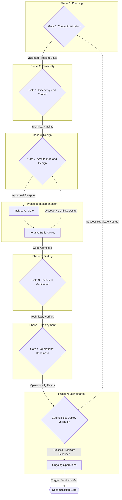

# The AI Orchestrator's SDLC Manual

## How to Use This Manual

**New projects:** Start at Phase 1. Do not begin implementation until the Problem Class Definition, Success Predicate, and AI Deployment Mode are documented and approved at Gate 0.

**Tasks within an active project:** Apply the Task-Level Gate at the start of any change that meets the Significance Triggers defined in Phase 4.

**Scaling depth:** Adjust documentation requirements based on risk level. See Appendix B.

---

## Framework Principles

**Problem class before implementation.** A system is defined by the class of problems it handles, not by the specific problem that prompted its creation. Build for the class. A system built for a single instance tends to become a liability when requirements shift.

**Sequential gates.** Each phase produces documented answers to specific questions. The next phase does not begin until those answers are approved. The questions are designed to surface assumptions while they are still inexpensive to address.

**AI Deployment Mode.** This framework distinguishes between AI used during the build process (Build-Time AI) and AI that executes as part of the live system (Runtime AI). Gate questions marked *[Runtime AI]* apply when an LLM executes in production. Questions marked *[Build-Time AI]* apply when AI assists in development. Unmarked questions apply in both cases.

---

## Process Flow

---

## Phase 1: Planning (Gate 0 — Concept Validation)

*Does this problem class warrant a system?*

### Step 1: Problem Class Definition

- **Problem Class:** What is the bounded category of problems this system is designed to handle? State this without referencing a solution. Be explicit about what falls outside the class; a system scoped to handle everything handles nothing reliably.
- **Success Predicate:** What logical condition, which may be composite, determines whether the system is handling its problem class correctly? If the predicate cannot be evaluated, the class definition is incomplete.
- **Evidence:** What observable signals confirm that this problem class exists and is not merely perceived?
- **Class Impact:** What does an unaddressed instance of this problem class cost in time, capital, errors, or risk at the expected frequency of occurrence?
- **Inertia Test:** What does the problem class cost if left unaddressed at scale over the mid-to-long term?

### Step 2: AI Deployment Mode

Declare whether AI is present in the build process only, in the runtime system only, or in both. This declaration determines which gate criteria are active throughout all subsequent phases. It is a design decision and must be documented explicitly.

- **Build-Time Only:** AI assists in writing, testing, or documenting the system. No LLM executes in production. Primary concerns are verification, structural integrity, and documentation discipline.
- **Runtime:** An LLM executes as part of the live system. All Build-Time concerns apply, plus: operational cost, data classification, provider reliability, observability, and human oversight of autonomous actions.
- **Both:** All concerns apply across the full lifecycle.

### Step 3: Timing, Origin, and Solution Space

- **Root Cause:** Why does this problem class exist? Is the gap process-based, technical, organizational, or a knowledge deficit?
- **Catalyst:** What changed recently that makes this class addressable now?
- **Solution Space:** What tools or systems already handle adjacent problem classes? Why are they insufficient for this one?

---

## Phase 2: Feasibility Analysis (Gate 1 — Discovery and Context)

*What are the constraints and risks before design begins?*

### Step 1: Environmental Mapping

- **Upstream Dependencies:** What systems or teams provide the inputs? Are those agreements stable?
- **Downstream Impact:** Who consumes the system's output? What is the Blast Radius if the system fails or handles a class-boundary case incorrectly?
  - *[Runtime AI]:* What happens when the LLM provider is unavailable, rate-limited, or degraded? Provider outages and latency events are routine operational occurrences. Define the fallback behavior as a design requirement in Phase 3.
- **Class Volume Analysis:** What is the expected cardinality and distribution of problems in this class: low, bursty, or continuous? Does the design assumption match the actual volume profile, including tail cases?
- **The Landlord:** Who owns and manages the infrastructure this system runs on?
- **Integration Assessment:** What proportion of the effort is core class logic versus integration work such as authentication, logging, and data translation?

### Step 2: Feasibility and Skills

- **Capability:** Is this buildable with the available team? Are there knowledge silos or single points of failure that introduce risk?
- **Justification:** Is the required investment proportionate to the value of the Success Predicate?
- **Operational Cost Model:** *[Runtime AI]* What is the estimated cost per problem-class instance at expected volume, at peak volume, and at tail volume? Inference cost is a design constraint. A system that is architecturally sound but financially untenable at scale has failed feasibility. If this cannot be estimated, Phase 3 should not begin.

### Step 3: Class Coverage and Scope

- **Minimum Class Coverage:** What percentage of the problem class must be handled for the system to be viable? What is intentionally left as manual or out of scope?
- **Minimum Viable Coverage:** What is the smallest version that validates the core class assumption?
- **Anti-Scope:** What is explicitly excluded, and why? Class boundaries should be documented as carefully as class inclusions.

---

## Phase 3: System Design (Gate 2 — Architecture and Liability)

*What does owning this system cost over time?*

### Step 1: Components and Contracts

- **Logical Boundaries:** What are the components and their boundaries? Use a contextual mapping model such as C4.
- **Bill of Materials (BOM):** List every required infrastructure resource and implementation artifact.
- **Class Interface Contract:** Define the schema that determines what a valid problem in this class looks like as an input, and what a valid resolution looks like as an output. No implementation begins until this contract exists.
  - *[Runtime AI]:* The Class Interface Contract must include Prompt Contracts: the defined structure of inputs to and expected outputs from each LLM call. Prompts are interfaces; apply the same version control and contract discipline used for APIs.
- **Data Boundary Declaration:** *[Runtime AI]* What data crosses into any LLM call? Is any of it subject to data classification, residency requirements, privacy regulation, or internal policy constraints? Identify this before the Class Interface Contract is finalized. If uncertain, escalate to a data governance or legal function before proceeding.

### Step 2: Architecture and Failure Modes

- **Class Boundary Behavior:** What happens when the system receives an input that is adjacent to the defined class but outside it? This is a design decision, not an error condition, and it must be made explicitly.
- **Failure Mode Discovery:** What is the user experience when a dependency fails?
  - *[Runtime AI]:* Define the system's behavior when the LLM provider is unavailable. Degradation, queuing, and clean rejection are all valid design choices; absence of a choice is not.
- **Breaking Point:** At what load does this design fail? Identify this before implementation, not after deployment.
- **Human Oversight Model:** *[Runtime AI]* For each action the system can take, define the oversight level: autonomous (AI acts without human confirmation), supervised (human reviews before execution), or advisory (human decides, AI informs). Document this in the ADR. Actions that are irreversible or carry significant blast radius require higher oversight levels. A system that cannot answer this question for each of its actions is not ready to proceed to Gate 3.
- **ADR (Architecture Decision Record):** Document major decisions and the reasoning behind them. For Runtime AI systems, ADRs must include model version rationale, human oversight decisions by action type, and data boundary decisions.

### Step 3: Environment and Verification Strategy

- **Infrastructure as Code (IaC):** How is infrastructure provisioned and managed?
- **Irreversibility Analysis:** Which commitments are difficult or impossible to reverse? Tie these to Gate 4 criteria; they are not executed until Phase 5 verification is complete.
- **Verification Strategy:** Define the behavioral eval criteria before implementation begins.
  - *[Runtime AI]:* Production behavior must not rely on nondeterministic AI outputs for control flow or safety-critical decisions. Define golden output sets or behavioral contract tests. Specify the model version pinning strategy. Note: pinning reduces drift but does not prevent it. Providers deprecate model versions on their own schedules. Treat pinning as a delay mechanism; the Phase 7 Class Drift Audit exists for the cases where pinning has expired or failed silently.

---

## Phase 4: Implementation (Build Cycles)

*Does each change serve the defined problem class?*

### Task-Level Gate (Start of Task)

Apply this gate to any modification that touches: data schemas or Class Interface Contracts; public interfaces or APIs; authentication or authorization logic; new external dependencies; LLM calls, agent actions, or nondeterministic execution paths.

1. **Class Alignment:** Does this change serve the Success Predicate, or does it expand the problem class without Gate 0 approval?
2. **Compatibility:** Is this change backward compatible with existing state?
3. **Idempotency:** What happens if this logic executes more than once?
4. **Error Path:** What is the recovery path if this fails mid-execution?
5. **YAGNI:** Does this implementation exceed the Minimum Class Coverage defined in Phase 2?
6. **Data Boundary:** *[Runtime AI]* Does this change introduce data into an LLM call that was not covered by the Data Boundary Declaration in Phase 3? If yes, resolve before continuing.

### Build Reconciliation (End of Task)

- **Variance:** What drift occurred from the original design? Is it documented?
- **Reality Check:** If the build reveals a mismatch between the design ceiling and the actual floor, return to Phase 2 before continuing.
- **Escalation:** If the implementation contradicts the approved architecture or expands the class definition, escalate to Phase 3 before continuing.

---

## Phase 5: Testing (Gate 3 — Technical Verification)

*Does the system satisfy the contracts defined in Phase 3?*

**Stop criteria:** Halt if core functional requirements fail, if the system cannot reach the Breaking Point identified in Phase 3, or if class boundary behavior is undefined.

### Step 1: Verification

- **Class Coverage:** Does the test suite cover the full breadth of the defined problem class, including boundary cases and class-adjacent inputs the system should reject or handle with a defined behavior?
- **Contract Verification:** Does the system adhere to the Class Interface Contracts defined in Phase 3?
- **Signal Verification:** Do health signals and alerts fire correctly under failure conditions?
- **Stress Test:** Has the system been tested against the Breaking Point identified in Phase 3?
- *[Runtime AI]:* Does the verification suite include behavioral evals that test class-level correctness against the criteria defined in Phase 3? Nondeterministic outputs producing different results from the same input is expected behavior, not a test failure, unless the output violates the class contract. Require that engineers demonstrate coverage of the Orchestrator-defined criteria; the specific testing methodology is the engineer's determination.

### Step 2: Diagnostic Audit

- **Self-Service Diagnosis:** Can a qualified person diagnose a failure without access to the original builder?
- **Traceability:** Are logs, traces, and metrics sufficient to reconstruct a failure after the fact?
  - *[Runtime AI]:* Are prompts, responses, and AI decisions logged in a way that is both auditable and compliant with the Data Boundary Declaration from Phase 3? Logging data that should not be logged is a compliance failure equivalent to not logging data that should be.

---

## Phase 6: Deployment (Gate 4 — Operational Readiness)

*Is the system safe to activate?*

**Stop criteria:** Halt if runbooks are untested or if the recovery and rollback procedure fails rehearsal.

### Step 1: Sustainability and Controls

- **SOPs (Standard Operating Procedures):** Are runbooks written and tested by someone other than the author?
- **Operational Controls:** Are automated limits or kill switches active for variable operational spend?
  - *[Runtime AI]:* Are privilege scopes of agentic components enforced at the infrastructure level, not only at the prompt level? Can AI-triggered state changes (data mutations, access grants, deployments) be halted independently? Is a cost circuit-breaker in place to prevent runaway LLM spend before it becomes a financial incident?

### Step 2: Handoff and Rollback

- **Rehearsal:** Has the recovery and rollback procedure been rehearsed in a non-production environment?
- **Independence:** Does the named owner from Phase 1 have sufficient context to operate the system without assistance?
- **Irreversibility Execution:** High-impact downstream changes identified in Phase 3 are executed only after all Phase 5 verification signals are confirmed.

---

## Phase 7: Maintenance (Gate 5 — Post-Deploy Validation)

*Did the system deliver what was defined in Phase 1?*

### Step 1: Validation

- **Audit:** Did the Success Predicate evaluate to true under real operating conditions?
- **Adoption:** After sufficient usage, do operators and consumers rely on the system with confidence?

### Step 2: Routine Review

- **Class Drift Audit:** Is the system still handling the problem class it was designed for? If operational reality has shifted the class definition, that shift must be documented and the corresponding design artifacts updated.
  - *[Runtime AI]:* Has the underlying model version changed? If so, re-validate behavioral evals against the Class Interface Contract. Provider behavior changes can affect output quality and latency even when the version identifier has not changed. Model version pinning delays drift; it does not prevent it.
- **Knowledge Persistence:** Have ADRs, Design Maps, Class Interface Contracts, and Data Boundary Declarations been preserved and updated to reflect current reality?
- **Living Document Protocol:** Document review is triggered by events, not only by calendar schedule. Triggers include: model version change, significant volume change, a new class-adjacent use case discovered in production, team ownership change, or any Class Drift finding. A document that has not been reviewed since a model upgrade does not reflect current reality.

### Step 3: Decommission Gate

- **Trigger:** Does maintenance cost exceed value? Has the problem class been dissolved, subsumed, or addressed at a higher level?
- **Execution:** Revoke access, archive records, and purge data according to policy.
  - *[Runtime AI]:* Confirm that LLM provider credentials, API keys, and service accounts are revoked. Confirm that logged prompt and response data is handled according to the retention policy established in the Data Boundary Declaration.

---

## Appendix A: Glossary

| Term | Definition |
|:---|:---|
| ADR | Architecture Decision Record. A file capturing a design decision, its context, and the reasoning behind it. |
| Behavioral Eval | A test verifying class-level correctness of nondeterministic outputs against Orchestrator-defined criteria. Methodology is an active area of development; the criteria take precedence over the method. |
| Blast Radius | The maximum potential impact of a single component failure or change. |
| BOM | Bill of Materials. A list of all infrastructure, libraries, and resources required. |
| Build-Time AI | AI used during development to write, test, or document the system. No LLM executes in production. |
| C4 | Context, Container, Component, Code. A mapping model for software architecture. |
| Class Boundary | The explicit definition of what inputs fall within the problem class versus adjacent to it. |
| Class Drift | The condition where a system's operational behavior has diverged from its designed problem class without a corresponding design revision. For Runtime AI systems, model version changes can produce class drift even without code changes. |
| Class Interface Contract | The schema defining what a valid input looks like and what a valid output looks like. Includes Prompt Contracts for Runtime AI systems. |
| Data Boundary Declaration | A documented statement of what data crosses into any LLM call and whether it is subject to classification, residency, or privacy constraints. |
| Human Oversight Model | The defined level of human involvement for each action a Runtime AI system can take: autonomous, supervised, or advisory. |
| IaC | Infrastructure as Code. Provisioning infrastructure through machine-readable definition files. |
| Living Document Protocol | A defined set of event-based triggers, beyond calendar cadence, that require review and update of design artifacts. |
| Minimum Class Coverage | The minimum percentage of the problem class the system must handle to be viable. |
| Minimum Viable Coverage | The smallest version that validates the core class assumption. |
| Problem Class | A bounded category of problems the system is designed to handle, with explicit inclusion and exclusion criteria. |
| Prompt Contract | The schema defining the structure of inputs to and expected outputs from an LLM call. |
| Runtime AI | An LLM that executes as part of the live system in production. |
| SDLC | Software Development Life Cycle. |
| SLO | Service Level Objective. A target level for the performance of a service. |
| SOP | Standard Operating Procedure. Step-by-step instructions for routine operations. |
| Success Predicate | A logical condition, which may be composite, that determines whether the system is correctly handling its problem class. |
| YAGNI | You Ain't Gonna Need It. Do not implement beyond Minimum Class Coverage until validated demand exists. |

---

## Appendix B: Rigor by Risk Level

| Risk Level | Requirements |
|:---|:---|
| Low | Verbal verification of Gate questions. Problem Class, Success Predicate, and AI Deployment Mode stated informally. |
| Medium | Lightweight documentation of Class Definition, Success Predicate, AI Deployment Mode, Class Interface Contract, and ADRs. Data Boundary Declaration required for Runtime AI systems. |
| High | Formal artifacts (C4, BOM, Prompt Contracts, Data Boundary Declaration, Human Oversight Model), peer review, behavioral evals, cost model, and documented Stop Criteria audits. |

---

## Appendix C: AI Deployment Mode Reference

| Concern | Build-Time AI | Runtime AI |
|---|---|---|
| Verification and structural integrity | Required | Required |
| Documentation discipline (ADRs) | Required | Required |
| Prompt Contracts | Not applicable | Required |
| Data Boundary Declaration | Not applicable | Required |
| Human Oversight Model | Not applicable | Required |
| Operational Cost Model | Not applicable | Required |
| Provider reliability and fallback design | Not applicable | Required |
| Behavioral evals | Not applicable | Required |
| LLM observability and tracing | Not applicable | Required |
| Cost circuit-breaker / kill switch | Not applicable | Required |
| Model version pinning and drift audit | Not applicable | Required |
| Prompt and response log compliance | Not applicable | Required |
